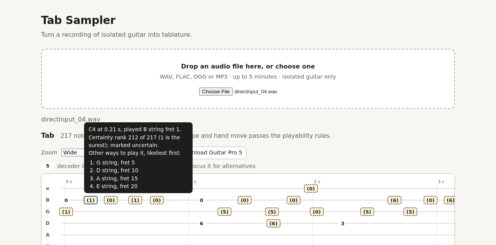

# Tab Sampler


**Tab Sampler turns a guitar recording into guitar tablature** — which string and fret each note
was played on — and shows how sure it is of every note.

```text
audio -> note events -> string/fret candidates -> fingering scorer -> decoder -> tab
```



*The local web app on a take from Guitar-TECHS's player 3 (CC BY 4.0).*

## Features

- **Tablature, not just notes.** Every note gets a string and a fret, chosen by a probabilistic
  decoder (Viterbi plus forward-backward) over playable chord shapes and hand movements.
- **Honest uncertainty.** Notes the decoder is least sure of are marked, and each note lists the
  other places it could be played, most likely first. Confidences are shown as a ranking, never as
  percentages, because they are not calibrated probabilities end to end.
- **Clean electric guitar mode.** A small string classifier listens to each note to judge which
  string it was played on; on the EGDB test set it raises the end-to-end score from 0.4547 to
  0.4992. Its weights are trained only on openly licensed data and published under CC BY 4.0.
- **Full songs (experimental).** The guitar can be separated from a band recording with Demucs
  (`htdemucs_6s`) before transcription.
- **A local web app and a CLI**, which produce the same tab note for note; export to **MusicXML**,
  **Guitar Pro 5**, JSON or ASCII.
- **Warnings instead of silent failures**: notes the guitar cannot sound, notes dropped to keep a
  chord playable, and recordings that are off standard pitch (A440) are reported.

## Quick start

Requirements: macOS on Apple silicon or Linux, [uv](https://docs.astral.sh/uv/), Python 3.13 for
the package and Python 3.11 for the transcriber (installed by the setup script).

```bash
git clone https://github.com/Afillex/TabSampler.git && cd TabSampler
uv sync --all-groups                 # the package, the web app, PyTorch and Demucs
bash scripts/setup_transcriber.sh    # Basic Pitch, in its own Python 3.11 environment
make electric-model                  # optional: the clean-electric classifier (193 KB, CC BY 4.0)
```

**Web app** — open <http://127.0.0.1:8000> after:

```bash
make serve
```

Drop a recording on the page; choose *Clean electric* for an electric guitar and *Full song* for a
band recording. The server listens on localhost only.

**Command line:**

```bash
uv run tabsampler transcribe take.wav                    # ASCII tab in the terminal
uv run tabsampler transcribe take.wav -o tab.json        # every note, its time and alternatives
uv run tabsampler transcribe take.wav -o tab.musicxml    # for MuseScore
uv run tabsampler transcribe take.wav -o tab.gp5         # for Guitar Pro or TuxGuitar
uv run tabsampler transcribe take.wav --electric         # clean electric guitar
uv run tabsampler transcribe song.mp3 --full-song        # separate the guitar from a band first
```

What the app can and cannot do, and what to expect, is in
[docs/using-the-app.md](docs/using-the-app.md).

## Results

The headline metric is **E2, exact tab F1**: a note counts only if its start (within 50 ms), its
pitch and its string all match the player's. It is reported in two modes. *End to end* is what a
user gets: the transcriber's notes, placed by the decoder. *Oracle* feeds the true notes to the
decoder, which isolates string choice.

| Test set | Sound | E2 end to end | E2 oracle |
|---|---|---|---|
| **EGDB**, 240 clips | electric, direct input | 0.4547 | 0.6762 |
| EGDB, with the clean-electric option | electric, direct input | **0.4992** | **0.7229** |
| GuitarSet players 01–05, 300 tracks | acoustic, microphone | 0.4553 † | 0.6819 |

† The transcriber, Basic Pitch, was trained on about 90% of GuitarSet's audio, so GuitarSet's
end-to-end figure is partly in-sample. EGDB is audio no part of the system was trained or tuned on.

What the numbers mean in practice: about half of the notes come out exactly right. On EGDB, missed
and extra notes from the transcriber cost about 0.22 of the score, and strings chosen differently
from the player's about 0.32 (given the true notes, the decoder alone reaches 0.6762). Chord shapes
are almost always playable: over 99% of them pass the playability rules. Treat the output as a
first draft to check by ear.

**Full songs** are measured on mixes built from labelled guitar takes over backing tracks with their
guitars removed. On validation data, pooled over three sets: the mix fed straight to the
transcriber scores 0.1902, the separated guitar 0.3180, and the guitar alone 0.4666. Test-set
figures are being measured.

**Speed:** a 3-minute recording takes about 5 seconds on an Apple M4 (transcription with a cold
cache, the tuning check and decoding); full-song separation adds roughly a third of the song's
length on the CPU.

Every figure above is from `experiments/results.csv`, measured under the protocol below. They are
not comparable to numbers published elsewhere, which use other protocols.

## How it works

1. **Transcription.** [Basic Pitch](https://github.com/spotify/basic-pitch) turns audio into note
   events, at thresholds chosen on validation data (onset 0.7, frame 0.4, minimum note 58 ms). It
   runs in its own Python 3.11 environment behind a subprocess and a content-addressed cache.
2. **Candidates.** Each note gets every (string, fret) that can sound it in the chosen tuning;
   simultaneous notes form chord shapes, pruned to what one hand can span.
3. **Scoring.** A cost model scores each chord shape and each move between shapes: hand movement,
   stretch, high positions, open strings — and, in electric mode, what the string classifier hears.
   The hand is modelled as a four-fret window that a wide chord can stretch.
4. **Decoding.** Viterbi finds the most likely fingering; forward-backward gives each note's
   posterior and its ranked alternatives. A brute-force decoder checks the fast one in the tests.
5. **Output.** The tab is drawn in the web app or written as ASCII, JSON, MusicXML or Guitar Pro 5.
   Rhythm is not transcribed: exports place notes on a fixed 120 BPM grid and say so inside the file.

Full-song mode adds a step before 1: Demucs separates the guitar stem from the mix.

## Evaluation protocol

- **Test sets are never used for tuning.** GuitarSet's players 01–05 and all of EGDB are test-only;
  the split is enforced in code (`data/splits.py`) and every read of a test set is logged with its
  reason in `experiments/test_set_access.log`.
- **Validation data** chooses everything: GuitarSet's player 00, Guitar-TECHS, EGSet12 and
  IDMT-SMT-Guitar's licks.
- **Every measurement is pre-registered**: the hypothesis, the single variable changed and the
  decision rule are committed before the run. Failed predictions are recorded, not dropped.
- **Decisions are documented** as Architecture Decision Records in [docs/adr/](docs/adr/).

## Limitations

- **One guitar.** Full-song mode separates *the* guitar; several guitars in one song are not told
  apart. The separator handles clean direct-input electric guitar poorly.
- **No rhythm**: no bars or note values. **No techniques**: bends, slides, hammer-ons, palm mutes
  and harmonics are not transcribed.
- **Standard pitch (A440) is assumed.** A guitar tuned between semitones loses notes; the app warns
  when a recording is a quarter of a semitone or more off.
- **Uncalibrated confidences** end to end; the uncertainty marks are a ranking.
- Recordings up to 5 minutes and 100 MB.

## Repository layout

```text
src/tabsampler/      the package: audio, transcribe, fingering, decode, eval, model, render, web
configs/             decoder and evaluation configurations
scripts/             data download, training, evaluation and checks
tests/               unit tests and the brute-force decoder oracle (offline, no datasets needed)
experiments/         results.csv and the test-set access log
docs/                report, specification, ADRs, plans, development log, user guide
```

## Development

```bash
make install     # uv sync --all-groups
make check       # lint + strict type check + tests — run before every commit
make test        # pytest (offline, no dataset needed)
make oracle      # brute-force equivalence tests for the decoder
make serve       # the local web app
```

The core package targets Python 3.13 and passes `pyright --strict`. Basic Pitch 0.4.0 installs only
on Python 3.11 or earlier on Apple silicon, so it lives in its own environment
(`scripts/setup_transcriber.sh`), which also pins `setuptools<81` for one of its dependencies.

## Datasets and credits

| Dataset | Used for | Licence |
|---|---|---|
| [GuitarSet](https://github.com/marl/GuitarSet) | test (players 01–05) and validation (player 00) | see its repository |
| [EGDB](https://ss12f32v.github.io/Guitar-Transcription/) | test | see its project page |
| [Guitar-TECHS](https://arxiv.org/abs/2501.03720) (H. Pedroza, W. Abreu, R. M. Corey, I. R. Roman) | electric classifier training | CC BY 4.0 |
| [EGFxSet](https://zenodo.org/records/7044411) (H. Pedroza, G. Meza, I. R. Roman) | electric classifier training | CC BY 4.0 |
| [EGSet12](https://zenodo.org/records/11406378) | validation | CC BY 4.0 |
| [IDMT-SMT-Guitar](https://zenodo.org/records/7544110) | validation only | CC BY-NC-ND 4.0 |
| [BabySlakh](https://zenodo.org/records/4603870) | backing for full-song mixes | CC BY 4.0 |
| DadaGP, SynthTab | fitting and pre-training experiments; resulting weights unpublished | research use |

Transcription by [Basic Pitch](https://github.com/spotify/basic-pitch); separation by
[Demucs](https://github.com/facebookresearch/demucs) (MIT).

## Documentation

| Document | What it covers |
|---|---|
| [docs/report.md](docs/report.md) | The project report: every phase, what was measured and what was learnt |
| [docs/using-the-app.md](docs/using-the-app.md) | Running the app, its limits, what to expect |
| [docs/spec.md](docs/spec.md) | Architecture, data contracts, metrics and phases |
| [docs/adr/](docs/adr/) | One Architecture Decision Record per decision |
| [docs/plans/](docs/plans/), [docs/devlog/](docs/devlog/) | Implementation plans and the development log |

## License

The code is MIT — see [LICENSE](LICENSE). The clean-electric classifier's weights
(`electric-model-v1` release) are CC BY 4.0, crediting Guitar-TECHS and EGFxSet. Datasets keep
their own terms; weights trained on DadaGP or SynthTab are not published.
